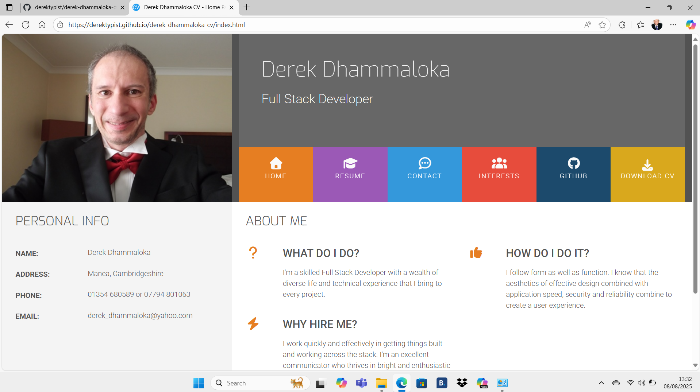
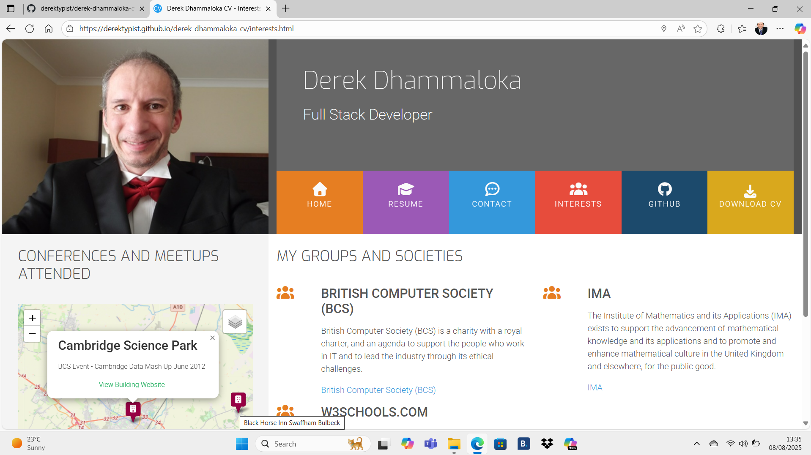
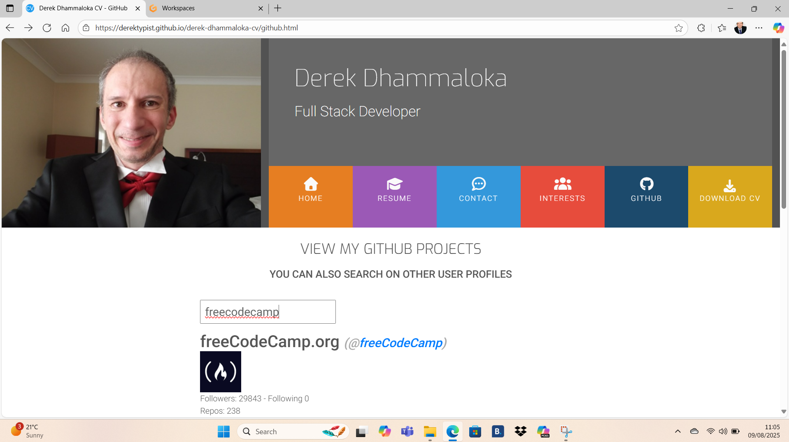
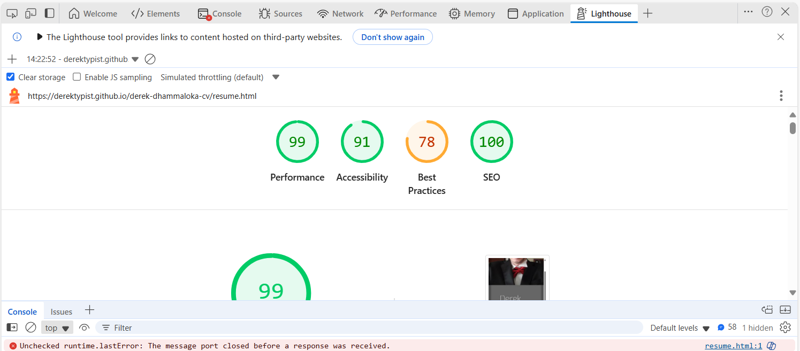

# Derek Dhammaloka CV

Welcome to Derek Dhammaloka's CV.  The purpose of this project is to provide information on Interests, GitHub, Resume and Contact.  A copy of the CV can be viewed and/or downloaded. All images are for illustration purposes only.

## UX

**Getting Started**

Simply visit one of the following pages:

- Index Page (Home)
- Resume
- Contact
- Interests
- GitHub
- Download CV

On each of the pages, there are links to Facebook and LinkedIn.  Tooltips are provided on hovering over the links.

On the Interests page, you can get more information on BCS, W3Schools and IMA by selecting one of the links (opens in a new tab).  You can also view the locations of the Conferences and Meetups I have attended on Leaflet - links to buildings (e.g. Hotels) are available and they open in a new tab.  The Conferences and Meetups do not have to be limited to Information Technology.

On the GitHub page, simply enter the username (e.g. derektypist) on the input field.  If the username is blank, you will be asked to enter a username.  If the username does not exist, then there is no information for that username.  If there is information for the username, you will see the username, image (if any), number of followers, number following, number of repositories and repo list.  If there are repos, select one of the repos to view the repository (opens in a new tab) or hover over one of the repos to view a tooltip (e.g. View Repository for Hello-World).  If you have made too many requests, you will be asked to wait until a certain time.

On the Download CV, you can download a copy of my CV for printing.

**User Stories**

As a user, I can view/download a copy of my CV.

As a user, I can get a tooltip (e.g. LinkedIn) by hovering over one of the social links.

As a user, if I am on the Interests page, I can get tooltips by hovering over the links.

As a user, if I am on the GitHub page and the username has repos, I can get tooltips by hovering over one of the repositories.  For example, `View repository for Hello-World`.

As a user, if I select one of the links, I can get more information on one of the links, for example `BCS` (opens in a new tab).

As a user, I can view my work history.

As a user, I can view my skills.

As a user, I can view my interests.

As a user, I can view GitHub Projects of anyone (including mine).

As a user, I can search on other user profiles (e.g. igorvanloo).

As a user, if I do not enter a username, I will be required to enter a username.

As a user, if I enter a username that does not exist, I will get the message

`No info found for user username`

As a user, if I have made too many requests, I will be asked to wait until a certain time.

**Information Architecture**

The CV is structured into:

- Index Page (Home)
- Resume
- Contact
- Interests
- GitHub
- Download CV

Organising principle is Biography.

### Index Page (Home)

The Index Page contains Personal Info and About Me.

About Me - What Do I Do?, How Do I Do It? and Why Hire Me?

### Resume

Work History and My Skills (Front End, Back End) 

### Contact

The Contact Page is where you (the user) can request a project by filling in the form.

### Interests

Interests Page gives details of Conferences and Meetups I have attended in a Map.

They can include professional organisations (e.g. Cambridge Data Mashup with
BCS at June 2012 - East Anglia Branch).  The Conferences and Meetups do not have to be limited to Information Technology.

Each item includes the following:

- Name of building
- Description of event
- Link to Website of building

Popup Example (For Illustration Purposes)

All locations on the map are approximate.

My Groups and Societies include BCS, IMA and w3schools.com (Public Facebook Group).  Tooltips are provided to let the browser know that the user has hovered over these interest links.

### GitHub

The GitHub Page is where you (the user) can view my GitHub Projects (user name derektypist)
as well as searching on other user profiles (e.g. igorvanloo).  If the username does not exist, the message `No info found for user username` appears.  If you hover over one of the repositories, you will get a tooltip (e.g. View Repository for Hello-World).  If you select one of the repositories, you can get more information on one of the repositories, for example `Hello-World` (opens in a new tab).

GitHub Information consists of:

- Username (e.g. derektypist)
- Image of Username (if any)
- Number of Followers
- Number Following
- Number of Repositories
- Repository List (if there are repos)

Each Repo has the URL (html_url) and name (name).

### Download CV

A PDF File of my CV is available for downloading (it opens in a new window).

## Features

Allows you to download a copy of my CV as well as visiting my LinkedIn Profile and my Facebook Profile.  You can even connect me on LinkedIn and make a friend request on Facebook.

You can view details of my work history and skills.

You can get more information on my interests in the interests page.  An interactive map is provided.  Choose streets or satellite view.  Hover on one of the markers to get a tooltip.  Click on one of the markers to view the title, description and link to the building website.

You can view my GitHub Projects as well as search for other user profiles.

- Navigation Bar

    - Featured on all pages, except the Download CV (which is a PDF).  Allows links to the Logo, Home Page, Resume, Interests, Contact and GitHub.  The Download CV opens in a new tab.

    = This section allows the user to easily navigate from page to page across all devices without having to revert to the previous page via the 'back' button.

- Resume Page

    - The resume page gives details of work history and skills (front end and back end)

- Interests Page

    - The interests page will allow the user to see a map of the conferences and meetups (usually in buildings) as well as the groups and societies.
    
    - Clicking on one of the building icons will give the popup (name of building, details of meetup and link to website of building, which opens in new tab to allow easy navigation for the user).

    - Hovering on one of the building icons will give tooltips on the name of the building.

    - Groups and Societies includes links to BCS, W3Schools.com and IMA.  The links will open in a new tab to allow easy navigation for the user.  Further links are available (e.g. Social Media).

- GitHub Page

    - The GitHub page allows the user to search user profiles.  Usage limits apply.  If there are too many requests, a message will be displayed, and the user will be asked to try again later.

    - Clicking on one of the repositories, will give details of the repository (opens in a new tab to allow easy navigation for the user).

    - Hovering over one of the repositories, gives a tooltip.

    - Clicking on one of the usernames, gives details of the username (opens in a new tab to allow easy navigation for the user).

- The Footer

    - The footer section includes links to the relevant social media.  The links will open in a new tab to allow easy navigation for the user.

    - The footer is valuable to the user as it encourages them to keep connected via social media.

## Technologies

- HTML5
- CSS3
- JavaScript
- jQuery
- Bootstrap 4.3.1
- Font Awesome 7.0.0
- LeafletJS with Marker Cluster and Extra Markers

## Testing

All External Links (including social media) open in a new window without leaving the website using the `target=_blank` attribute.  The links are manually tested to
ensure that they are taken to the correct destination.

A Lighthouse Report can be obtained.  On a Chromium-based Web Browser (e.g. Microsoft Edge) right-click on a page, select `Inspect`.  Select Lighthouse, then `Analyze Page Load`.

Lighthouse Report for the Home Page

Lighthouse Report for the Resume Page

Lighthouse Report for the Contact Page

**Validator Testing**

- HTML
    - No errors were found when through through the official [W3C Validator](https://validator.w3.org/nu/?doc=https%3A%2F%2Fderektypist.github.io%2Fderek-dhammaloka-cv)

- CSS
    - No errors were found when passing through the official [(Jigsaw) Validator](https://jigsaw.w3.org/css-validator/validator?uri=https%3A%2F%2Fderektypist.github.io%2Fderek-dhammaloka-cv%2Findex.html&profile=css3svg&usermedium=all&warning=1&vextwarning=&lang=en)

## Deployment

This is deployed on [GitHub Pages](https://derektypist.github.io/derek-dhammaloka-cv) at the Master Branch.

Use the command

    git push
    
to update any changes

## Credits

### Content

Most of the code is taken from the mini-project video with Code Institute.  Icons taken from the official Font Awesome website.

### Media

Images (including screenshots) are provided by myself.

### Acknowledgements

- [Code Institute](https://www.codeinstitute.net)
- [Esri](https://www.esri.com) for Satellite Map
- [Font Awesome](https://www.fontawesome.com)
- [Google](https://www.google.co.uk)
- [Leaflet](https://leafletjs.com)
- [Meetup](https://www.meetup.com)
- [Open Street Maps](https://www.openstreetmap.org) including [Copyright Information](https://www.openstreetmap.org/copyright) for Streets Map
- Raimonda Svirskis - IPES Key Worker - CPA5